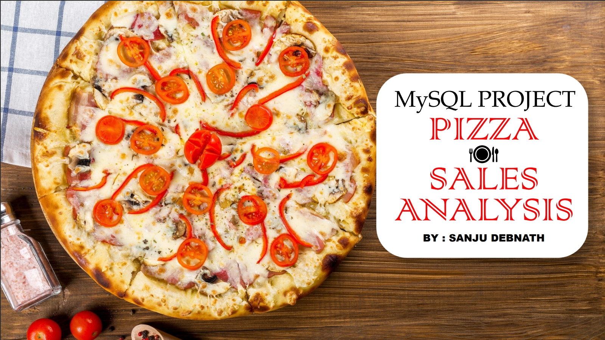

<h1 align="center">PIZZA SALES ANALYSIS MySQL PROJECT</h1>
<p align="center" 

DESCRIPTION :
-
This project analyzes pizza sales data using MySQL to uncover insights into customer preferences, popular toppings, sales trends, and profitability. It involves importing, cleaning, and exploring the dataset before performing analyses such as identifying top-selling pizzas, seasonal sales patterns, and customer demographics. Visualizations are created to present findings effectively, while performance metrics are calculated to evaluate business performance. The project aims to provide actionable recommendations for improving sales, marketing strategies, and customer satisfaction, showcasing proficiency in MySQL data analysis techniques and the ability to derive meaningful insights from real-world datasets.

Key Steps:
-
1. Data Import: Import the pizza sales dataset into MySQL database tables.
2. Data Exploration: Explore the dataset to understand its structure and contents.
3. Data Analysis: Perform various analyses to uncover insights, such as:
   - Most popular pizza types.
   - Total sales revenue.
   - Total orders.
   - Most ordered pizza size.
     
Data Tables:
-
- Orders_details
- Orders
- Pizzas
- Pizza_types

Related Question:
-
1.Retrieve the total number of orders placed.

2.Calculate the total revenue generated from pizza sales.

3.Identify the highest-priced pizza.

4.Identify the most common pizza size ordered.

5.List the top 5 most ordered pizza types along with their quantities.

6.Join the necessary tables to find the total quantity of each pizza category ordered.

7.Determine the distribution of orders by hour of the day.

8.Join relevant tables to find the category-wise distribution of pizzas.

9.Group the orders by date and calculate the average number of pizzas ordered per day.

10.Determine the top 3 most ordered pizza types based on revenue.

11.Calculate the percentage contribution of each pizza type to total revenue.

12.Analyze the cumulative revenue generated over time.

13.Determine the top 3 most ordered pizza types based on revenue for each pizza
category

# Here are some impotants intriguing findings:

📈 Key Metrics:
-
- Total Orders: 21,350 🛒
- Total Revenue: $817,860 💰
- Highest Priced Pizza: The Greek Pizza 🇬🇷
- Average Orders per Day: 138 📅

🍽️ Contribution of Each Pizza Type to Total Revenue:
-
- Classic: 27%
- Supreme: 26%
- Chicken: 24%
- Veggie: 23%

Our analysis provides valuable insights into customer preferences, revenue distribution, and pricing strategies. Stay tuned for more exciting projects and insights!

PROJECT LINK :
-
- [PIZZA SALES MySQL QUERIES](https://github.com/Sanjudebnath123/PIZZA_SALES_ANALYSIS_MySQL_PROJECT/blob/main/Pizza%20Sales%20Analysis%20MySQL%20Queries.sql)
- [PIZZA SALES PRESENTATION](https://github.com/Sanjudebnath123/PIZZA_SALES_ANALYSIS_MySQL_PROJECT/blob/main/Pizza%20Sales%20MySQL%20Project%20PPT.pdf)

CONCLUSION :
-
In conclusion, the Pizza Sales Analysis project utilizing MySQL showcases the power of data-driven decision-making in optimizing business operations. By meticulously examining customer preferences, sales trends, and profitability metrics, actionable insights emerge to refine marketing strategies, enhance product offerings, and improve customer satisfaction. Through data import, cleaning, analysis, and visualization, this project exemplifies proficiency in MySQL data analysis techniques. The recommendations derived from this analysis offer valuable guidance for enhancing sales performance and overall business success. Overall, this project underscores the importance of leveraging data analytics to drive informed decisions and achieve competitive advantage in the pizza industry.

Tools used :
-
<p align="left" 

Crafted by :
-
-[@Sanjudebnath123](https://github.com/Sanjudebnath123)

Sanju Debnath - Data Analyst
